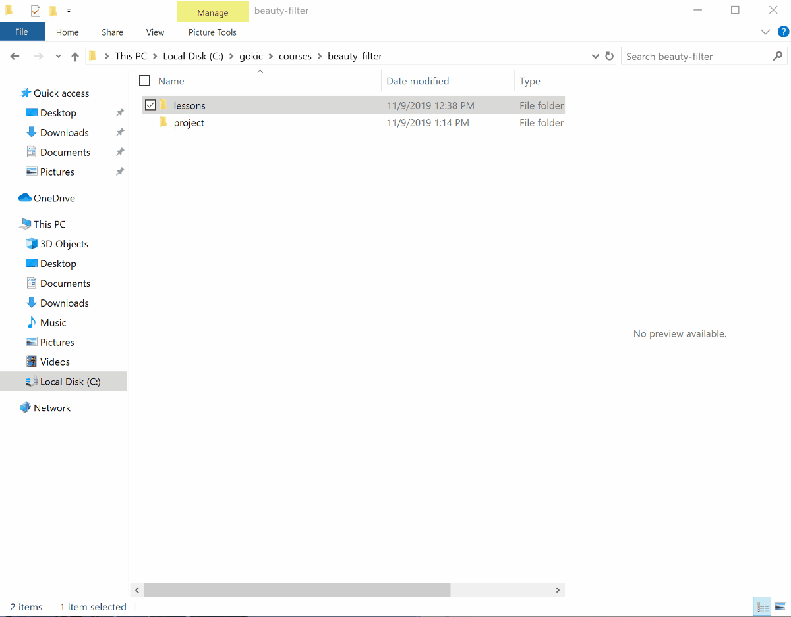
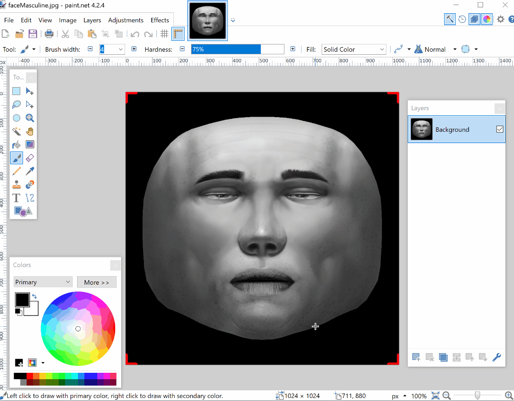
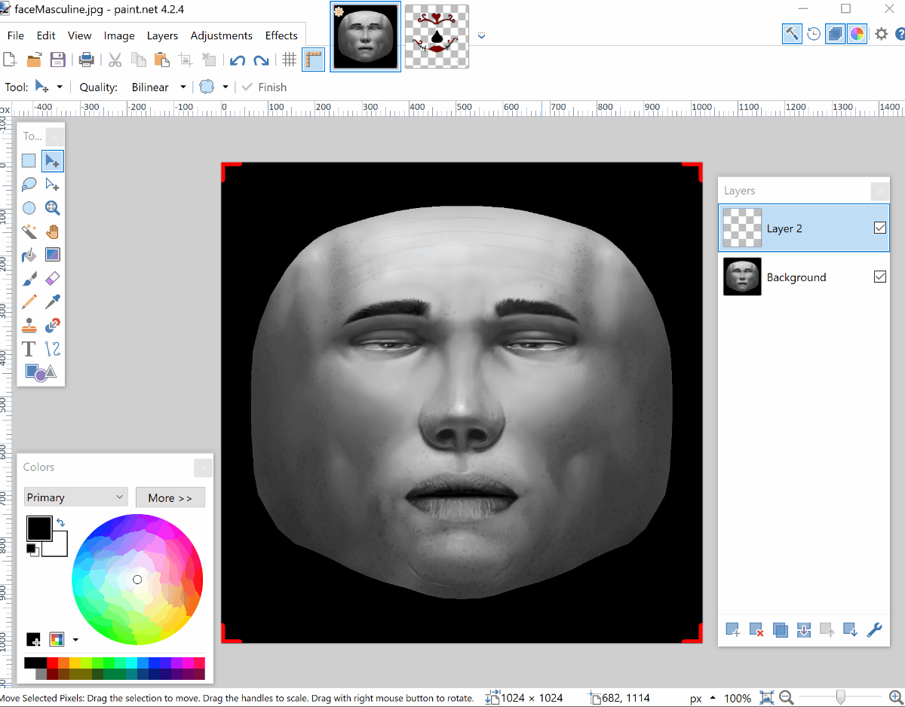

# Step 3: Painting our face like a catrina - catrina texture

The face texture will be our catrina painting:
1. In a file explorer go to `lessons\resources\facebook-reference\FaceAssets\Textures`
2. Right click on either faceFeminine.jpg or faceMasculine.jpg
3. Select open with -> paint .net

Before we paint our catrina face, we'll need to add a new layer

Now you're ready to paint your catrina. Use the face as background to paint anything you want. I will use the highlights of a catrina I drew. 

Let's apply your catrina face to our face mesh

Finally, let's add another face mesh to color our face white

[<< Previous Lesson](lesson.3.md) | [Next Lesson >>](lesson.5.md)